<div align="center">

# **Hi 👋, I'm Dana.**
### *Full-Stack Developer • Digital Architect • Code Artist*

```ascii
╔═══════════════════════════════════════════════════════════════╗
║  💫 Crafting exceptional web experiences with modern tech     ║
║  🎯 Building tomorrow's digital solutions today               ║
╚═══════════════════════════════════════════════════════════════╝
```
</div>

<div align="center">
  
[](https://git.io/typing-svg)

</div>

---

## 🚀 **Current Mission**

```javascript
const dana = {
  status: "🔍 Actively seeking opportunities",
  location: "🇺🇸 United States (Work authorized)",
  focus: ["Full-Stack Development", "Data Science", "AI/ML"],
  currentProject: "🎨 Portfolio Masterpiece",
  availability: "✅ Open to internships & full-time roles"
};

console.log(`${dana.status} - Let's build something amazing together! 🚀`);
```

---

## ⚡ **Tech Arsenal**

<details>
<summary>🎨 <strong>Frontend Wizardry</strong></summary>
<br>

| Category | Technologies |
|----------|-------------|
| **Languages** |     |
| **Frameworks** |    |
| **Styling** |  |

</details>

<details>
<summary>⚙️ <strong>Backend Mastery</strong></summary>
<br>

| Category | Technologies |
|----------|-------------|
| **Runtime** |   |
| **Databases** |     |
| **APIs** |   |

</details>

<details>
<summary>☁️ <strong>Cloud & DevOps</strong></summary>
<br>

| Category | Technologies |
|----------|-------------|
| **Cloud** |     |
| **Tools** |   |
| **IDE** |   |

</details>

---

## 📊 **GitHub Analytics**

<div align="center">
  
  
</div>

<div align="center">
  


</div>

---

## 🎯 **Featured Projects**

```mermaid
graph LR
    A[🎨 Portfolio] --> B[Modern Design]
    A --> C[Smooth Animations]
    A --> D[Responsive Layout]
    
    E[🚀 Web Apps] --> F[Full-Stack]
    E --> G[RESTful APIs]
    E --> H[Database Design]
    
    I[🤖 AI Projects] --> J[Machine Learning]
    I --> K[Data Analysis]
    I --> L[Deep Learning]
```



---

## 🌐 **Let's Connect**

<div align="center">

### 💼 **Professional Network**
[](https://danadavis.dev)
[](https://www.linkedin.com/in/dana-davis-a5b102254/)
[](mailto:dana@danadavis.dev)

### ☕ **Support My Work**
<a href="https://www.buymeacoffee.com/danadavis" target="_blank">
  
</a>
&nbsp;&nbsp;
<a href="https://www.patreon.com/danadavisdev" target="_blank">
  
</a>

</div>

---

<div align="center">

```ascii
╔══════════════════════════════════════════════════════════════╗
║ Code is poetry written in logic, crafted with passion       ║
║                         - Dana Davis                        ║
╚══════════════════════════════════════════════════════════════╝
```

**⭐ If you find my work interesting, consider giving it a star!**


</div>
