```mermaid
graph LR
    A[🎨 Portfolio] --> B[Modern Design]
    A --> C[Smooth Animations]
    A --> D[Responsive Layout]
    
    E[🚀 Web Apps] --> F[Full-Stack]
    E --> G[RESTful APIs]
    E --> H[Database Design]
    
    I[🤖 AI Projects] --> J[Machine Learning]
    I --> K[Data Analysis]
    I --> L[Deep Learning]
```

<div align="center">

#  Hi, I'm Dana

### *Full-Stack Developer • Digital Architect • Code Artist*

</div>

<div align="center">
  
[](https://git.io/typing-svg)

</div>

---
##  **WHAT I BRING TO THE TABLE**

<table>
<tr>
<td width="50%">

<div align="right">
  
</div>

### 🎯 **My Superpowers**

- **🔥 Full-Stack Development** - From pixels to databases
- **🧠 Problem Solving** - Love turning complex challenges into simple solutions  
- **⚡ Fast Learner** - Always adapting to new technologies
- **🤝 Team Player** - Great software is built by great teams
- **🎨 Creative Coder** - Making functional beautiful

</td>
<td width="50%">

### 📊 **Current Activities**

```text
🔭 Building full-stack applications
🌱 Learning advanced cloud architectures  
👯 Open to collaboration on innovative projects
🤔 Exploring AI/ML integration in web apps
💬 Ask me about React, Node.js, or Python
📫 Reach me at dana@danadavis.dev
⚡ Fun fact: I debug better with music on 🎵
```

</td>
</tr>
</table>

##   **Current Mission**

```javascript
const dana = {
  status: "🔍 Actively seeking opportunities",
  location: "🇺🇸 United States (Work authorized)",
  focus: ["Full-Stack Development", "Data Science", "AI/ML"],
  currentProject: "🎨 Portfolio Masterpiece",
  availability: "✅ Open to internships & full-time roles"
};

console.log(`${dana.status} - Let's build something amazing together! 🚀`);
```

---

##  **Tech Arsenal**

<details>
<summary>🎨 <strong>Frontend Wizardry</strong></summary>
<br>

| Category | Technologies |
|----------|-------------|
| **Languages** |     |
| **Frameworks** |    |
| **Styling** |  |

</details>

<details>
<summary>⚙️ <strong>Backend Mastery</strong></summary>
<br>

| Category | Technologies |
|----------|-------------|
| **Runtime** |   |
| **Databases** |     |
| **APIs** |   |

</details>

<details>
<summary>☁️ <strong>Cloud & DevOps</strong></summary>
<br>

| Category | Technologies |
|----------|-------------|
| **Cloud** |     |
| **Tools** |   |
| **IDE** |   |

</details>

---

## &nbsp; **GitHub Analytics**

<div align="center">
  
  
</div>

<div align="center">
  


</div>

---

##   **Featured Projects**



---

##  **Let's Connect**

<div align="center">

### 💼 **Professional Network**
[](https://danadavis.dev)
[](https://www.linkedin.com/in/dana-davis-a5b102254/)
[](mailto:dana@danadavis.dev)

### ☕ **Support My Work**
<a href="https://www.buymeacoffee.com/danadavis" target="_blank">
  
</a>
&nbsp;&nbsp;
<a href="https://www.patreon.com/danadavisdev" target="_blank">
  
</a>

</div>

---

<div align="center">

<!-- The workspace never sleeps -->


```javascript
// dana-davis.dev/thoughts/latest-commit.js
const rightNow = new Date();
const mood = rightNow.getHours() > 22 ? 'inspired' : 'caffeinated';
const nextIdea = await brain.process(yourVisit);

console.log(`💡 ${nextIdea} sparked by your visit`);
// TODO: Turn this into something amazing together
```


*2:47 AM • Still coding • Music: On • Coffee: Empty • Ideas: Endless*


</div>
